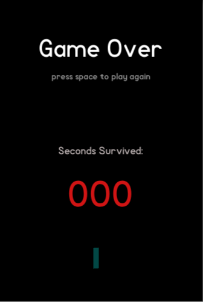
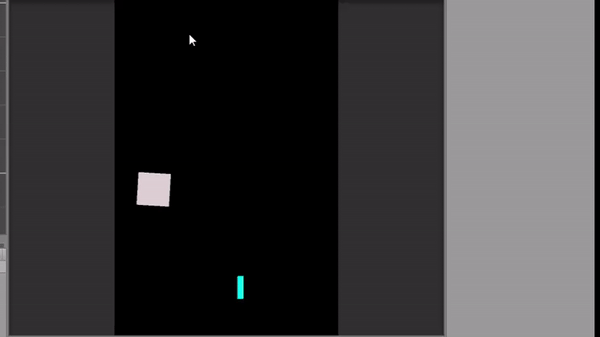

# Escaped

A simple project made using Unity . A 2d Game for Android.

# How to Play:

Simply install the Android apk in the source file to play .

# Controls

Left : Click and hold left touch of the mobile or device
Right: Click and hold right touch Screen of the mobile or device.

# Screeenshots

  

## 2

  

